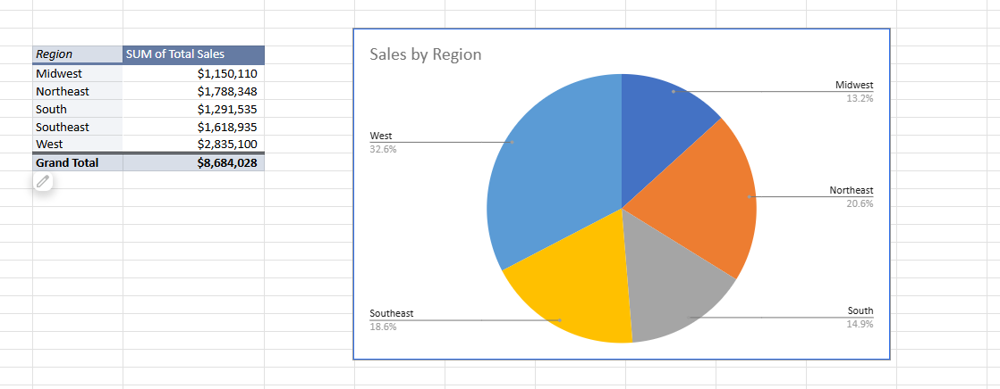
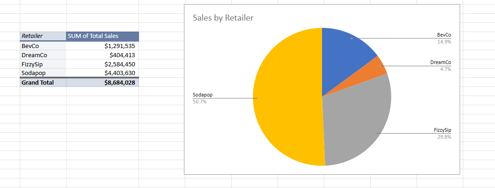
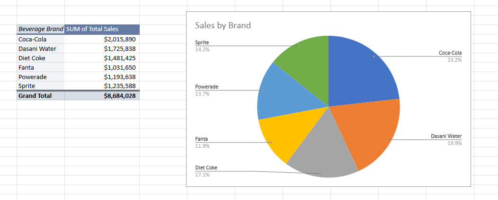
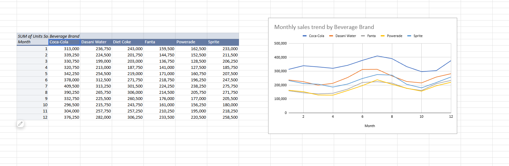
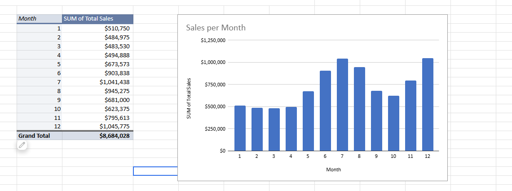
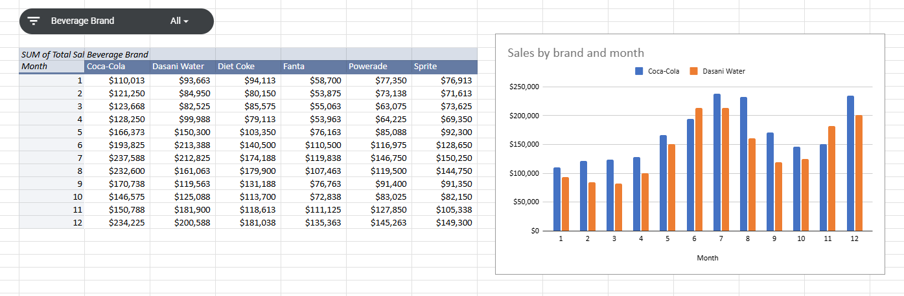
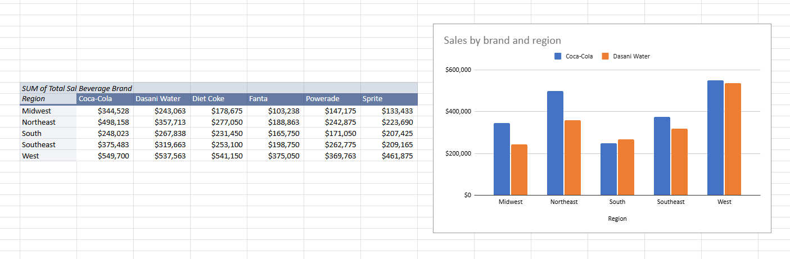
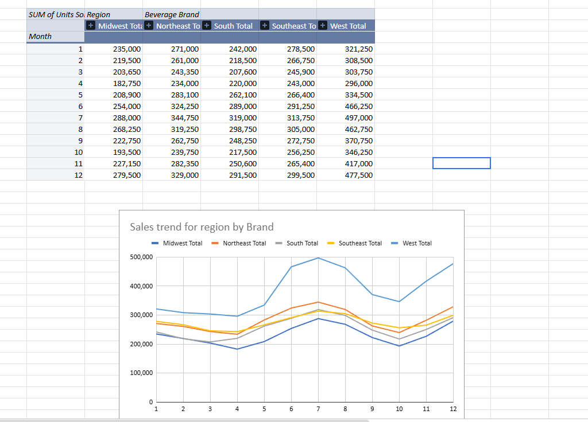
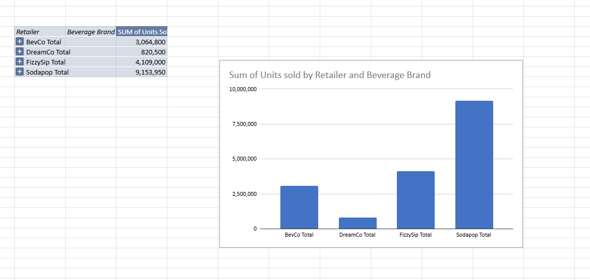
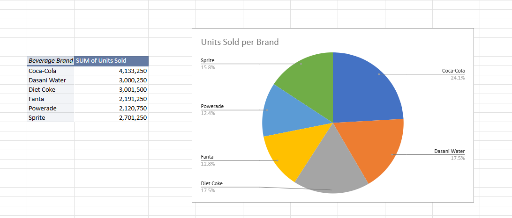

# 📊 Coke Sales Analysis using Excel

## 📌 Project Overview
This project analyzes Coca-Cola sales data across multiple U.S. retailers to uncover insights related to sales performance, profitability, and regional trends.

The goal is to answer key business questions:
- How do sales vary across regions, retailers, and products?
- What is the relationship between pricing, volume, and profitability?
- Are there any seasonal trends in sales?

---

## 📂 Dataset Description
The dataset contains transactional-level data where each row represents a product sale for a specific retailer, location, and date.

### Key Columns:
- Retailer & Retailer ID  
- Region, State, City  
- Beverage Brand  
- Price per Unit  
- Units Sold  
- Total Sales  
- Operating Profit  
- Operating Margin  
- Invoice Date & Month  

---

## 🧹 Data Preparation
- Standardized column names  
- Cleaned inconsistent or missing values  
- Converted data types (dates and numeric fields)  
- Ensured consistency across regions and products  
- Structured metrics for analysis  

---

## 📁 Project Structure

- **Beginner Sheet** → Basic aggregations and KPIs  
- **Intermediate Sheet** → Sales comparison across regions, products, and retailers  
- **Advanced Sheet** → Profitability and pricing analysis  
- **Additional Analysis** → Trends, patterns, and deeper insights  

---

## 📊 Key Analysis Performed

### 🔹 Sales Analysis
- Total Sales: ~ $8.68 Million  
- West region generates the highest revenue  
- Sales are concentrated among top retailers  

---

### 🔹 Product Performance
- Coca-Cola is the top-performing product  
- Followed by Dasani Water and Diet Coke  
- Core products drive the majority of revenue  

---

### 🔹 Retailer Analysis
- Sodapop contributes the highest revenue share  
- Strong dependency on top-performing retailers  

---

### 🔹 Time-Based Analysis
- Peak sales observed in **July and December**  
- Lower sales in early months  
- Indicates strong seasonal trends  

---

### 🔹 Profitability Insights
- High sales does not always mean high profitability  
- Operating margins vary across products and regions  
- Pricing significantly impacts profit margins  

---

## 📈 Tools & Techniques Used
- Microsoft Excel  
- Pivot Tables  
- Data Cleaning & Transformation  
- Data Aggregation  
- Data Visualization (Bar Charts, Line Charts)  

---

## 📷 Project Visualizations

### 📍 Sales by Region

### 📍 Sales by Retailer

### 📍 Sales by Brand

### 📍 Monthly Sales Trend

### 📍 Sales Per Month

### 📍 Sales by Brand and Month

### 📍 Sales by Brand and Region

### 📍 Regional Sales Trend

### 📍 Units Sold Analysis

### 📍 Units Sold per Brand

---

## 💡 Key Insights
- West region dominates both revenue and volume  
- Sales are heavily dependent on a few retailers  
- Seasonal demand significantly impacts sales  
- Core beverage products contribute most of the revenue  

---

## 🚀 Recommendations
- Focus on high-performing regions like West  
- Optimize pricing strategies to improve margins  
- Reduce dependency on single retailers  
- Leverage peak months for targeted marketing campaigns  

---

## 🎯 Conclusion
This project demonstrates how Excel can be used to transform raw sales data into actionable insights. The analysis supports data-driven decision-making to improve business performance and profitability.

---
